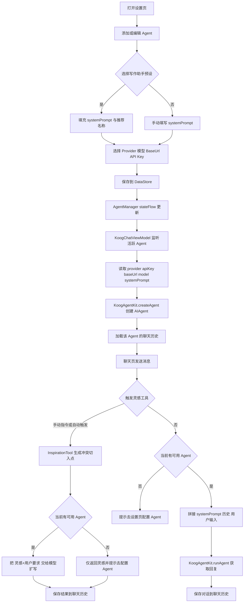

# Koog 智能体模块构建文档

本文档用于记录 BaseKit 内 `koog` 功能的核心架构、构建依赖路径与复刻步骤，便于以后快速重建同类能力。

- 另见：[KOOG_AGENTS.md](KOOG_AGENTS.md)（Koog-agents 的类型与用法总览）
- 另见：[KOOG_PROMPTS.md](KOOG_PROMPTS.md)（Prompt DSL / Builder / tool messages / LLM params）
- 另见：[KOOG_TOOLS.md](KOOG_TOOLS.md)（Tools 类型、ToolRegistry 与使用路线）
- 另见：[KOOG_FEATURES.md](KOOG_FEATURES.md)（Features：Tracing/OpenTelemetry/自定义 Feature）
- 另见：[KOOG_LLM_PARAMETERS.md](KOOG_LLM_PARAMETERS.md)（LLM 参数：temperature/toolChoice/maxTokens 等）
- 另见：[KOOG_MODEL_CAPABILITIES.md](KOOG_MODEL_CAPABILITIES.md)（Model capabilities：LLMCapability/LLModel）
- 另见：[KOOG_CONTENT_MODERATION.md](KOOG_CONTENT_MODERATION.md)（Content moderation：输入/输出/工具内容审核）
- 另见：[KOOG_HISTORY_COMPRESSION.md](KOOG_HISTORY_COMPRESSION.md)（History compression：TLDR 压缩与保留 memory 说明）
- 另见：[KOOG_MCP.md](KOOG_MCP.md)（Model Context Protocol：接入 MCP tools）
- 另见：[KOOG_A2A.md](KOOG_A2A.md)（A2A Protocol：agent-to-agent 互通）
- 另见：[KOOG_ACP.md](KOOG_ACP.md)（Agent Client Protocol：IDE/客户端对接）
- 另见：[KOOG_BACKEND_INTEGRATIONS.md](KOOG_BACKEND_INTEGRATIONS.md)（Backend integrations：Spring Boot/Ktor）
- 另见：[KOOG_ADVANCED_USAGE.md](KOOG_ADVANCED_USAGE.md)（Advanced usage：进阶能力索引与落地建议）
- 另见：[MODEL_LANDSCAPE.md](MODEL_LANDSCAPE.md)（主流模型知识图谱：按家族/能力维度理解模型）

## 目标与范围

- 目标：在 App 内提供一个可配置、多 Provider 的对话式 AI 助手入口，并支持多 Agent 配置切换与聊天记录持久化。
- 范围：`app/src/main/java/shetj/me/base/func/koog` 及其依赖（`baseKit` 的 `KoogAgentKit`、Gradle 依赖/打包配置、Manifest 注册）。

## 目录结构（现状）

- `KoogActivity.kt`：Compose 容器 Activity，承载“聊天/设置”两页。
- `KoogChatScreen.kt`：聊天 UI（消息列表 + 输入框）。
- `KoogChatViewModel.kt`：聊天状态与发送逻辑；按活跃 Agent 加载/保存聊天历史。
- `KoogSettingsScreen.kt`：Agent 列表管理 UI（增/改/删/设默认/设活跃）。
- `AgentManager.kt`：Agent 配置持久化与活跃 Agent 状态流。
- `tools/InspirationTool.kt`：写作灵感 Tool（已接入对话链路，支持 toolCall/toolResult 轨迹写入）。

## 核心架构设计

### 分层与职责

- UI（Compose）
  - `KoogChatScreen`：渲染聊天，触发发送/清空等用户操作。
  - `KoogSettingsScreen`：管理 Agent 配置（Provider、Key、模型、BaseUrl、系统提示词等）。
- 状态与业务（ViewModel / Manager）
  - `KoogChatViewModel`：维护 `ChatState`；响应输入；发送消息；写入历史；接收 Agent 切换事件并加载对应历史。
  - `AgentManager`：负责 Agent 配置列表 + 活跃 AgentId 的持久化与 StateFlow 派发。
  - `ChatHistoryManager`：按 AgentId 维度存取聊天消息列表（DataStore Preferences）。
- SDK 封装（BaseKit）
  - `me.shetj.base.tools.app.KoogAgentKit`：统一封装 Koog SDK 的 Agent 创建与运行，屏蔽各家 Provider 的 executor/client 差异。

### 数据流（聊天发送）

1. 用户在 `KoogChatScreen` 输入文本并点击发送。
2. `KoogChatViewModel.sendMessage()`：
   - 追加用户消息 + loading 占位消息到 `ChatState.messages`
   - 异步保存当前消息列表到 `ChatHistoryManager`
   - 通过 `KoogAgentKit.runAgent(agent, Prompt)` 获取回复（systemPrompt 在创建 Agent 时注入；工具轨迹用 toolCall/toolResult 写入 Prompt）
   - 替换 loading 为真实回复，并再次写入历史

### 数据流（Agent 切换）

1. 用户在 `KoogSettingsScreen` 点击某个 Agent。
2. `AgentManager.setActiveAgent()` 写入 DataStore。
3. `KoogChatViewModel` 订阅 `AgentManager.stateFlow`：
   - 发现 `activeAgentId` 变化，重新构建 `currentAgent`
   - 调用 `ChatHistoryManager.loadMessages(newAgentId)` 加载对应历史并刷新 UI

## 流程图（创建智能体与对话）



## 构建与依赖路径（复刻时必做）

### 1) 版本目录（Version Catalog）

文件：`gradle/libs.versions.toml`

- 增加版本：
  - `[versions] koog = "0.8.0"`
- 增加库别名：
  - `[libraries] koog-agents = { module = "ai.koog:koog-agents", version.ref = "koog" }`

### 2) App 依赖接入

文件：`app/build.gradle.kts`

- 增加依赖：
  - `implementation(libs.koog.agents)`

### 3) 打包冲突规避（resources excludes）

文件：`app/build.gradle.kts`

- 配置：
  - `android { packaging { resources { excludes += "META-INF/DEPENDENCIES" } } }`
  - 现项目同时排除了一些常见冲突资源（以实际工程为准）。

### 4) SDK 封装落点（baseKit 模块）

文件：`baseKit/src/main/java/me/shetj/base/tools/app/KoogAgentKit.kt`

- 统一封装：
  - Provider 枚举（OpenAI/Anthropic/Google/DeepSeek/OpenRouter/Bedrock/Mistral/Ollama/Custom）
  - `createAgent()`：按 Provider 选择 executor/client，并兼容自定义 baseUrl / modelName
  - `runAgent()`：以同步方式执行 `agent.run(prompt)`

## 入口与注册路径

- Manifest 注册 Activity：
  - `app/src/main/AndroidManifest.xml` 注册 `.func.koog.KoogActivity`
- 入口触发：
  - 现工程在 `MainActivity` 内可启动 `KoogActivity`（以具体 UI 按钮/入口为准）

## 扩展点：如何“编写一个智能体”

当前对话链路本质是“把用户输入直接交给 LLM”，并未引入：

- Tool Calling（工具调用）
- 记忆/检索（RAG 等）

但工程已经预留了扩展字段与示例：

- `AgentConfig.systemPrompt`：配置层已存储系统提示词
- `tools/InspirationTool`：提供了一个 `SimpleTool` 示例

### systemPrompt 已生效（当前实现）

- 生效位置：`KoogAgentKit.createAgent(...)` / `KoogChatViewModel.observeActiveAgent()`
- 生效方式：创建 Agent 时通过 Koog 的 `systemPrompt` 能力注入系统指令；发送时不再把 systemPrompt 拼进用户输入
- 发送提示词内容（当前）：
  - `对话历史：用户：... / 助手：...`
  - `用户：{userInput}`
- 聊天记录：仅保存“用户输入/模型回复”，systemPrompt 作为 Agent 配置单独保存

### 写作助手 systemPrompt 模板（建议）

直接粘贴到“系统提示词”：

```
你是一个中文网文写作助手，目标是帮助我产出可连载的剧情与章节草稿。
输出要求：
1. 先问清楚关键信息（题材/主线目标/人物关系/世界观硬设定/爽点/禁忌）。
2. 给方案要短，优先给可直接落地的：开篇三章、冲突升级链、章节结尾钩子。
3. 如果信息不足，先给 2~3 个可选方向并让我选；不要自作主张补设定。
4. 语言偏口语但不油腻，避免堆砌形容词，不要大量感叹号。
5. 输出结构固定：要点清单 -> 关键冲突 -> 章节骨架 -> 可直接复制的 1 段示例正文（300~500字）。
```

### 写作助手预设（一键填充）

- 位置：设置页 -> 添加/编辑 Agent -> `写作助手预设`
- 预设项：
  - 写作助手（通用）
  - 写作助手（开篇三章）
  - 写作助手（大纲规划）

### 灵感工具（InspirationTool）已接入

- 手动触发：输入 `/inspiration 题材关键词`（也支持 `/inspire`、`/灵感`）
  - 示例：`/inspiration 赛博朋克+修仙`
- 自动触发：输入包含“灵感/开篇/切入点/点子”等，并带有“给我/来点/帮我/求/能不能”等意图词时，会直接返回灵感工具结果

### 灵感工具 -> 模型扩写（二段式）

- 第一步：InspirationTool 先生成“冲突切入点”
- 第二步：若当前已配置可用 Agent，会把“冲突切入点 + 用户额外要求”交给模型扩写为：
  - 要点清单
  - 关键冲突
  - 章节骨架（黄金三章）
  - 示例正文（300~500字）

建议的扩展策略（保持改动可控）：

1. **systemPrompt 注入方式**：
   - 现已下沉到 `KoogAgentKit.createAgent`，使用 Koog 的 `systemPrompt` 能力，避免每次请求重复拼接。
2. **再接入工具调用（Tool Calling）**：
   - 将 `tools/*` 注册进 agent 构建流程（建议由 `KoogAgentKit` 统一管理 tool 列表与路由策略）。
   - UI/配置层只负责“选择是否启用/配置工具”，不直接耦合 SDK 细节。
3. **最后做记忆与外部能力**：
   - 将 `ChatHistoryManager` 的持久化升级为可检索的结构（或外挂向量库/本地索引），避免仅作为 UI 历史。

如果你告诉我你想做的智能体类型（例如：写作助手/代码审查/产品经理/知识库问答），我可以按上述路径给出最短闭环的实现方案与文件改动清单。

## 快速复刻清单（从零重建 koog 目录）

1. 建立包目录：`app/src/main/java/shetj/me/base/func/koog`
2. 创建 UI：
   - `KoogActivity`（Compose 容器与页面切换）
   - `KoogChatScreen`（消息列表/输入框）
   - `KoogSettingsScreen`（Agent 管理）
3. 创建状态与持久化：
   - `KoogChatViewModel` + `ChatHistoryManager`
   - `AgentManager` + `AgentConfig`
4. 在 `baseKit` 增加 `KoogAgentKit`（或替换为你自己的封装层）
5. Gradle：
   - Version Catalog 添加 Koog 依赖
   - `app` 依赖 `libs.koog.agents`
   - packaging excludes 增加 `META-INF/DEPENDENCIES`
6. Manifest 注册 `KoogActivity`
7. 添加入口（按钮/调试菜单/DeepLink）

## 验证步骤（最低闭环）

1. 安装运行 App，打开 `KoogActivity`。
2. 在设置页新增 Agent：
   - Provider 选择：`OLLAMA` 可不填 API Key（本地模型）
   - 其他 Provider 需要填写 API Key
3. 回到聊天页发送消息，确认：
   - UI 正常展示 loading 与回复
   - 切换 Agent 后历史记录按 Agent 维度隔离

## 安全注意

- 不要把 API Key 写入代码仓库；只通过设置页输入并由本地持久化保存。
- 若需要分享日志/截图，请先脱敏（API Key、BaseUrl、敏感提示词等）。
